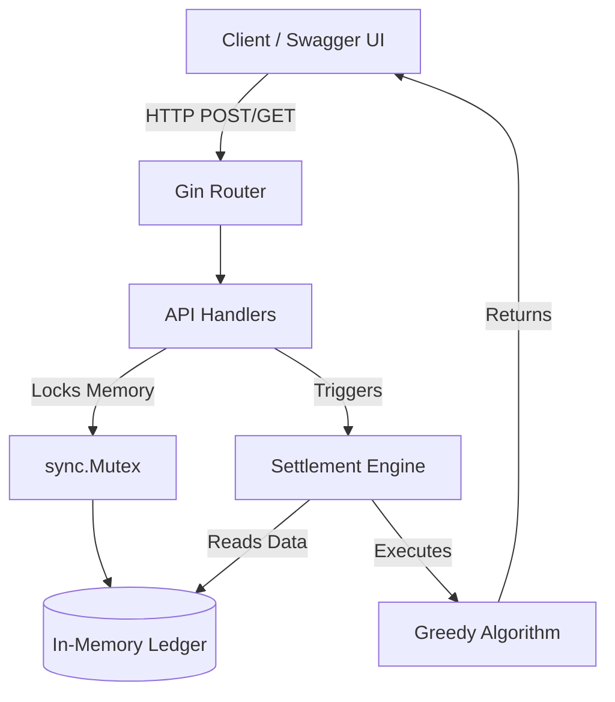

# Go Expense Tracker & Minimum Cash Flow API

A high-performance, concurrent REST API built in Go. This system acts as a shared expense tracker that mathematically reduces complex, overlapping group debts into the absolute minimum number of cash flow transactions using a Greedy Algorithm.

## Architecture Diagram

## Visual Proof & Performance

### 1. OpenAPI/Swagger UI Dashboard

### 2. Microsecond Execution Speeds

---

## Methodology: From Zero to Deployment

This project was architected in distinct engineering phases to ensure scalability, thread safety, and enterprise readiness.

### Phase 1: Domain Modeling & Memory Management

Static Typing: Defined strict Go structs to represent ExpenseRequests, Balances, and Transactions.

State Management: Implemented an in-memory Hash Map to track user ledgers dynamically, prioritizing pure algorithmic speed over database latency during prototyping.

### Phase 2: Algorithmic Optimization (Core Engine)

The Problem: Standard peer-to-peer payments create cyclical debt graphs.

The Solution: Implemented a Greedy Algorithm to solve the Minimum Cash Flow problem.

Execution: Separates users into Debtors and Creditors, recursively matching the maximum debtor with the maximum creditor until the ledger zeroes out.

Time Complexity: O(N log N) due to the sorting mechanism.

### Phase 3: Concurrent API Layer

Framework: Utilized the Gin HTTP framework to expose the algorithmic engine.

Thread Safety: Wrapped the in-memory ledger in a sync.Mutex to prevent data race conditions during concurrent high-volume HTTP requests.

### Phase 4: Enterprise Security & Testing (NEW)

Input Validation: Implemented Gin binding tags to enforce strict JSON payload rules (e.g., rejecting negative amounts or empty arrays) to prevent server panics.

Unit Testing: Integrated native Go tests (testing package) to mathematically verify the accuracy of the settlement algorithm.

### Phase 5: OpenAPI & Containerization (NEW)

Documentation: Auto-generated a swagger.json specification file and served an interactive Swagger webpage directly from the Gin router.

Deployment: Packaged the application using a multi-stage Dockerfile, resulting in a microscopic, cloud-ready Alpine Linux image.

---

## Tech Stack

* Language: Go 1.21+

* Web Framework: Gin

* Concurrency: Goroutines & sync.Mutex

* API Documentation: Swaggo (OpenAPI 2.0)

* DevOps: Docker (Multi-stage builds)

* Testing: Go Native Testing

---

## API Reference
Base URL: http://localhost:8080

### 1. Add Expense

POST /expense
Divides the bill equally among all participants and credits the payer.

{
  "payer": "Alice",
  "amount": 300.00,
  "participants": ["Alice", "Bob", "Charlie"]
}

### 2. Get Current Balances

GET /balances
Returns the live net position of all users.

{
  "current_balances": {
    "Alice": 200,
    "Bob": -100,
    "Charlie": -100
  }
}

### 3. Settle Debts

GET /settle
Executes the Greedy Algorithm to return the optimized payment plan.

{
  "message": "Debts optimized successfully",
  "optimized_transactions": [
    {"from": "Charlie", "to": "Alice", "amount": 100},
    {"from": "Bob", "to": "Alice", "amount": 100}
  ]
}

## Quick Start Setup

### Option 1: Run Locally

* Clone the repository and navigate into it.

Install dependencies:

* go mod tidy

Run the unit tests:

* go test ./internal/algorithm/ -v

Start the server:

* go run cmd/server/main.go

### Option 2: Run via Docker

docker build -t expense-api .
docker run -p 8080:8080 expense-api

Access the Swagger UI: http://localhost:8080/swagger/index.html

